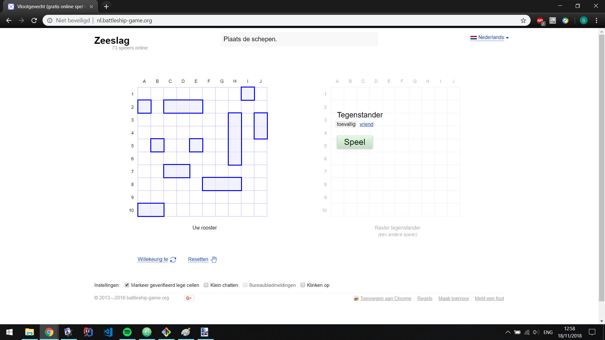

# Assignment 1

##### Team name:
### Group 44

##### Members:

### Gijs Groote  4483987
### Nicolas Plas 4689593


---
__Contents__
- 1. **HTTP request messages: GET/HEAD**
- 2. **HTTP request messages: PUT**
- 3. **Basic authentication**
- 4. **Web programming project: board game app**
- 5. **Design your own board game app**
- 6. **Your own board game app: HTML**

---

**1. HTTP request messages: GET/HEAD**

**1.1)** *
Write down the HTTP requests you made, the returned responses (e.g. a page has moved or is faulty) until you receive the contents of the Dutch rainfall radar page. Always use HEAD first to retrieve meta-­data about the resource.*

[Long telnet response weer.nl URL](https://github.com/GijsGroote/web-and-database-technology/blob/master/doc/assignments/assignment_1_resources/Assignment1_1.html)

**1.2)** *
Does the content correspond to what you see when accessing the page with your browser? To check, save the response to a file, use .html as file ending and open it with your browser.*

It looks a lot alike but not completely, instead of the clean site we have this text at the top of the site.

```
Trying 52.214.61.159... Connected
to
b2cwebsite-live-lb-960116390.eu-west
-1.elb.amazonaws.com. Escape
character is '^]'. HTTP/1.1 200 OK
Age: 542 Cache-Control: max-age=600
Content-Type: text/html;
charset=utf-8 Date: Tue, 20 Nov
2018 11:23:16 GMT Server:
nginx/1.12.0 Vary: Accept-Encoding
Via: 1.1 varnish-v4 X-Cache: HIT
X-Powered-By: PHP/5.5.26 X-Varnish:
1023082487 1023706730 Connection:
keep-alive HTTP/1.1 200 OK
Accept-Ranges: bytes Age: 572
Cache-Control: max-age=600
Content-Type: text/html;
charset=utf-8 Date: Tue, 20 Nov
2018 11:23:16 GMT Server:
nginx/1.12.0 Vary: Accept-Encoding
Via: 1.1 varnish-v4 X-Cache: HIT
X-Powered-By: PHP/5.5.26 X-Varnish:
1024295001 1023706730
transfer-encoding: chunked
Connection: keep-alive 3184
```

for the rest the content is the same.

**1.3)** *
What is the purpose of the X-UA-Compatible or the X-Cache tag in the header information (you should have seen one of the two or both - if you saw both, pick one to explain)?*

The purpose of the X-cache tag is to to check wether this site has been visited by this computer before, if it hasn't it will be a HIT and else a MISS. If it's a HIT, the page will be loaded for the first time and saved to the cache of your webbrowser, and when it is visited again after that, it will be a MISS and solely loaded from your browser cache.

**1.4)** *
What does the page's Cache-Control directive mean?*

Cache control is an HTTP header. It is used to stipulate browser caching procedures with respect to client requests and server responses. These procedures determine how a resource is cached, how long it is cached for, its time to live, etc...

**2. HTTP request messages: PUT**

**2.1)** *
The Content-­length is exactly the number of characters (12 - we count the whitespace as well!) of Hello World!. What happens if the Content-length field is smaller or larger than the exact number of characters in the content?*

The put command doesn't work and this pops up to the command window

```
wlan-145-94-226-161:~ Nicolas$ telnet httpbin.org  80|tee Assignment2_1
Trying 52.203.102.189...
Connected to httpbin.org.
Escape character is '^]'.
PUT /put HTTP/1.1
host:httpbin.org
Content-type:text/plain
Content-length:10

Hello World!
HTTP/1.1 200 OK
Connection: keep-alive
Server: gunicorn/19.9.0
Date: Tue, 20 Nov 2018 12:35:08 GMT
Content-Type: application/json
Content-Length: 296
Access-Control-Allow-Origin: *
Access-Control-Allow-Credentials: true
Via: 1.1 vegur

{
  "args": {},
  "data": "Hello Worl",
  "files": {},
  "form": {},
  "headers": {
    "Connection": "close",
    "Content-Length": "10",
    "Content-Type": "text/plain",
    "Host": "httpbin.org"
  },
  "json": null,
  "origin": "145.94.226.161",
  "url": "http://httpbin.org/put"
}
HTTP/1.1 400 Bad Request
Connection: close
Server: Cowboy
Date: Tue, 20 Nov 2018 12:35:08 GMT
Content-Length: 0

Connection closed by foreign host.
```

We get a 400 bad request error.

**3. Basic authentication**

**3.1)** *
First, open http://httpbin.org/basic-auth/user/passwd in your browser. You should see a dialogue, requesting username and password. Use user as username and passwd as password (it is just a coincidence that the actual username and password is the same as the URL path). Reload the web page -­ what happens now?*

We stay logged in with this text on the site.

```
{
  "authenticated": true,
  "user": "user"
}
```

**3.2** *
Now let's see how this works with actual HTTP messages. Start off with a HEAD method to inspect the web page and document all following steps (requests and responses):
Request the same page - what happens? Is the behavior the same as reloading the page in the browser? Explain why / why not.*

When we first try to connect without the authorization we get an unauthorized status:

```
Trying 52.201.75.180...
Connected to httpbin.org.
Escape character is '^]'.
HEAD /basic-auth/user/passwd HTTP/1.1
host:httpbin.org

HTTP/1.1 401 UNAUTHORIZED
Connection: keep-alive
Server: gunicorn/19.9.0
Date: Tue, 20 Nov 2018 12:49:10 GMT
Www-Authenticate: Basic realm="Fake Realm"
Access-Control-Allow-Origin: *
Access-Control-Allow-Credentials: true
Content-Length: 0
Via: 1.1 vegur
```

When we use the authorization header, we do get authorized:

```
HEAD /basic-auth/user/passwd HTTP/1.1
host:httpbin.org
Authorization: basic [dXNlcjpwYXNzd2Q=]

HTTP/1.1 200 OK
Connection: keep-alive
Server: gunicorn/19.9.0
Date: Tue, 20 Nov 2018 12:49:44 GMT
Content-Type: application/json
Content-Length: 47
Access-Control-Allow-Origin: *
Access-Control-Allow-Credentials: true
Via: 1.1 vegur
```


**4. Web programming project: board game app**

**4.1)** *
First of all, settle on the game you will implement in your team.*

We have choosen to create Battleship.

**4.2)** *
Find four examples of your chosen board game (in 2D) that can be played online in a modern browser (laptop or desktop, not a mobile device). Consider the web application's design (focus on the game screen) based on the web design principles covered in class. Record the game URLs. Which design aspects stand out positively and which stand out negatively? Make a screenshot of each example and annotate the good and the bad.*

#### Battleship example 1


[Battleship example 1 URL](https://www.alteredgamer.com/free-pc-gaming/99268-battleship-games-wage-a-naval-war-online/)

This game is beautifull. The look is just beatifull. It should be against a other player in an online game (and not a computer). The statics above come in handy, this will be implemented in hour game as well.

#### Battleship example 2



[Battleship example 2 URL](http://nl.battleship-game.org/)

The functionality is there. However the css in the game could be a little more than just the basic grid. Also the statics are missing, how many times can i shoot where are my boats hit. Notice this is still in the setup of the game. The boats are not yet placed.

#### Battleship example 3


[Battleship example 3 URL](https://www.mathsisfun.com/games/battleship.html)

Great Looking game. It appears to be somewhere in between 2D and 3D. appart from being black and white the boats do look nice, the effectiveness of the board could be better. Only a part of the screen is part of the game. This should be extended to a larger portion of the screen.

#### Battleship example 4


[Battleship example 4 URL](https://www.mathplayground.com/battleship.html)

Even though the boats and colors look a bit basic. the game does feels old school. This is a good thing, battleship is an old game and the retro style should be amplified. Als well as example 3 the board could take up an larger amount of the screen.

**4.3)** *
Which game features in the examples of 4.2) stand out positively and which stand out negatively?*

Positive are the game colors, boats and grid should be properly styled css. Also the grid in which the boats are placed should be 'full screen' or at least take up a large amount of space. Statics do come in handy. They give you the feeling that you can play with a certain strategy.

Less positive (bad) aspects are black and white colors. These are just less comfortable to look at. The playground of the game should not be small. At least 50% of the screen widht and height should be part of the board game.

**5. Design your own board game app**

**5.1)** *
Create a design for the splash screen (also known as entry page): think of a name for your application, a short description & a logo. Feel free to use media (images, sound) with a Creative Commons license. You can start your resource search here.*

**5.2)** *
Create a design for the game screen, keeping the requirements listed above in mind as well as your findings in Exercise 4.3). You have a lot of artistic freedom in designing the board and game information.*

**5.3)** *
Once you have completed the design of your app, head over to CSE1500's 💡 Brightspace, go to Discussions and then the forum BOARD GAME APP DESIGNS. Create a thread with your team's name as subject/title (e.g. CSE234) and post your team's proposed splash screen and game screen. Feel free to also add a paragraph describing your choices.*


**6. Your own board game app: HTML**
*
Similar to the course book, take your design as a starting point and create the respective two HTML documents. These documents should only contain HTML, no CSS or JavaScript. To get an idea on the expected amount of content, check game.html and splash.html of the demo board game. Ignore the few lines of code loading JavaScript and CSS files, these will be covered in Assignments 2 and 3 respectively.*
